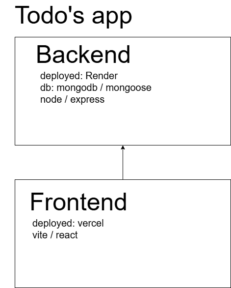

# MERN todos

- mern-todos NOTE: the backend is running on Render (free plan) - it spins down after 15 minutes of inactivity. each time the service starts again, it can take up to a minute it to get back online.



# Backend: Node.js + Express + Mongoose (for MongoDB)

- to use es-module syntax: package.json

```json
{
  //...
  "type": "module"
}
```

- use nodemon as a dev dependency to continuously watch the server

### deployment to Render

- unless you use Vercel serverless api -> use deployment with something like [Render](render.com)

### setup server on Render

- new -> web service
- set root folder: `backend/`
- build command: `npm install`
- run: `npm run dev`
- set env variables
- gives you deployed url: eg. `https://mern-todos-ndam.onrender.com` which you can use to connect on frontend via environment variable

---

# Frontend: React (using Vite)

### initiate project

- create a typescript vite project
- `npm create vite@latest . -- --template react-ts`

### when using fetch() instead of axios

```js
const res = await fetch(API_URL);
const data = await res.json();
setTodos(data);
```

### env

- Vite only exposes env variables to your code if they start with `VITE_`.
  - eg. `VITE_API_URL=`

### consuming env

```js
//frontend
const baseURL = import.meta.env.VITE_API_URL;
const API_URL = `${baseURL}/api/todos`;
```

---

# Database: MongoDB (local or MongoDB Atlas)

### mongodb

- create cluster
- network access -> allow access from anywhere
- connect to cluster using driver -> mongoose (v7 or later)
- create database user/password -> role (read/write to any db) -> SAVE

### mongoose configure

- get MOGO_URI from mongodb (login and get database details)

- configure mongoose MONGO_URI via .env
